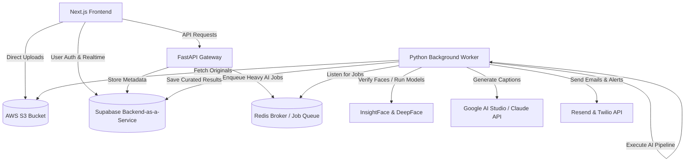
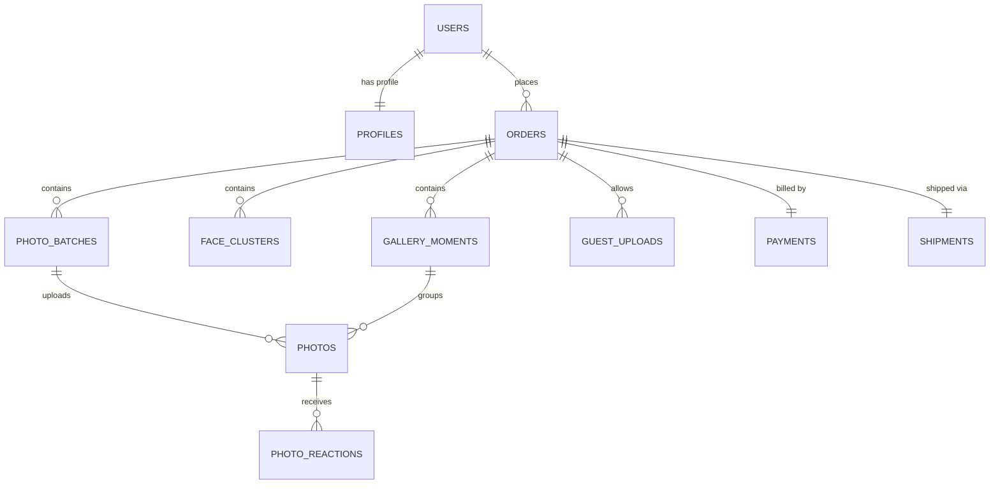

# 📸 MemoryLane — AI-Powered Smart Photo Album & Gallery Platform

MemoryLane is a modern, production-ready web application designed to curate, sequence, caption, and host premium digital & print photo albums. Tailored for major lifetime events (weddings, travel, family albums, and corporate events), it uses a multi-layered AI pipeline to analyze aesthetic quality, detect faces, group individuals, generate narrative-driven captions, and package it into an interactive digital experience with print-on-demand fulfillment.

---

## 🏗️ System Architecture

MemoryLane is designed as a decoupled, multi-service architecture optimized for speed, reliability, and cost-efficiency:



### Key Components
1. **Frontend (Next.js)**: Server-side rendering (SSR), responsive layout, fluid client-side route handling, and direct AWS S3 uploads using presigned URLs.
2. **Backend Gateway (FastAPI)**: Lightweight, high-performance API handling authentication context verification, rate-limiting, and payments.
3. **Background Worker (Redis + BullMQ/Task Queue)**: Decouples long-running ML analysis (face clustering, image quality heuristics) from request-response cycles.
4. **Cloud Infrastructure**:
   - **Supabase**: Handles user authentication, Row Level Security (RLS) policies, and stores structured database metadata.
   - **AWS S3**: Secure, scalable blob storage for high-resolution images.
   - **Razorpay**: E-commerce payment gateway for Indian credit cards, UPI, and wallets.
   - **Resend & Twilio**: Automated lifecycle notifications via email and WhatsApp.

---

## ✨ Features

- **🧠 Multi-Heuristics AI Curation**: Combines exposure analysis, blur detection, resolution checking, and deep aesthetic ranking (NIMA) to filter out bad shots.
- **👥 Smart Face Clustering**: Groups photos automatically based on face recognition (using `InsightFace` / `DeepFace` with dynamic fallback mockups for developer setups).
- **✍️ Generative Storytelling**: Automatically writes poetic, cinematic, or documentary captions based on image content using Google Gemini & Anthropic Claude APIs.
- **📖 Digital Album Flipbook**: Beautiful interactive layout mimicking a physical photo album, allowing page flips, guest reactions (emojis), and password protection.
- **⚡ Hybrid Queue System**: Native Redis task broker with an automatic fallback to an in-app async asyncio queue for zero-redis developer mode.
- **🔒 Secure by Design**: Enterprise-grade Row Level Security (RLS) on all database tables protecting user data, order status, and customer shipments.

---

## 📂 Repository Structure

The workspace is organized as a monorepo workspace containing separate, isolated projects:

```
Up Stack/ML/
├── memorylane-frontend/       # Next.js Frontend (Next.js, pnpm, Tailwind CSS, Vercel)
│   ├── src/app/              # Next.js App Router structure
│   ├── src/components/       # Reusable UI parts (Shadcn, custom)
│   └── DEPLOY.md             # Vercel Deployment Instructions
├── memorylane-backend/        # FastAPI Backend (Python 3.11, Uvicorn, Railway)
│   ├── services/             # Core AI processing and image heuristics logic
│   ├── routes/               # API endpoints (Uploads, orders, payments)
│   └── DEPLOY.md             # Railway Deployment Instructions
├── supabase/                  # Database configuration files and migrations
├── AUTH_SETUP.md              # OAuth & Google Social Logins credentials setup
└── README.md                  # Root documentation (this file)
```

---

## 🗄️ Database Schema & Entities

The platform is backed by PostgreSQL on Supabase. Below is a conceptual entity-relationship mapping derived from the production [schema.sql](file:///c:/Users/aryan/OneDrive/Desktop/Up%20Stack/ML/memorylane-backend/schema.sql):



### Table Dictionary
- **`profiles`**: User metadata, matching the Supabase `auth.users` ID. Includes studio branding details if the user is registered as a photographer.
- **`orders`**: Tracks individual photo books, status transitions (`draft`, `paid`, `processing`, `delivered`), styling configurations (language, captions style), and public gallery properties.
- **`photo_batches`**: Batches of photos uploaded at the same time. Tracks async processing status (`pending`, `running`, `completed`).
- **`photos`**: Individual photo entries containing metadata like S3 keys, AI score fields (quality, aesthetic, final rank), generated captions, and face cluster mappings.
- **`face_clusters`**: Aggregated groupings of matching faces recognized across a photo collection.
- **`guest_uploads`**: Images uploaded by guests via a live gallery link (supports moderation status: `pending`, `approved`, `rejected`).
- **`payments`**: Razorpay transaction identifiers, amounts, and statuses.
- **`shipments`**: Shipping company, tracking numbers, and delivery dates for physical prints.

---

## ⚡ Quickstart

To spin up the entire application locally, configure the frontend and backend services:

### 1. Database Configuration
Ensure your Supabase PostgreSQL instance has the database structure loaded. Run the contents of the database schema file:
- Execute [schema.sql](file:///c:/Users/aryan/OneDrive/Desktop/Up%20Stack/ML/memorylane-backend/schema.sql) in the Supabase SQL editor.
- Follow [AUTH_SETUP.md](file:///c:/Users/aryan/OneDrive/Desktop/Up%20Stack/ML/AUTH_SETUP.md) to set up Google OAuth.

### 2. Backend Startup
```bash
cd memorylane-backend
# Set up Python virtual environment and install dependencies
pip install -r requirements.txt
# Run FastAPI server
uvicorn main:app --reload
```
*For detailed setup, configuration fallbacks, and starting background workers, see [Backend README](file:///c:/Users/aryan/OneDrive/Desktop/Up%20Stack/ML/memorylane-backend/README.md).*

### 3. Frontend Startup
```bash
cd memorylane-frontend
# Install packages
pnpm install
# Spin up Next.js
pnpm dev
```
*For component structure and state management, see [Frontend README](file:///c:/Users/aryan/OneDrive/Desktop/Up%20Stack/ML/memorylane-frontend/README.md).*

---

## 🚢 Deployment Reference

Detailed guides on deploying MemoryLane to cloud platforms:
- **FastAPI / Redis Worker Deployment**: Refer to the [Backend Deployment Guide](file:///c:/Users/aryan/OneDrive/Desktop/Up%20Stack/ML/memorylane-backend/DEPLOY.md).
- **Next.js Web Client Deployment**: Refer to the [Frontend Deployment Guide](file:///c:/Users/aryan/OneDrive/Desktop/Up%20Stack/ML/memorylane-frontend/DEPLOY.md).
